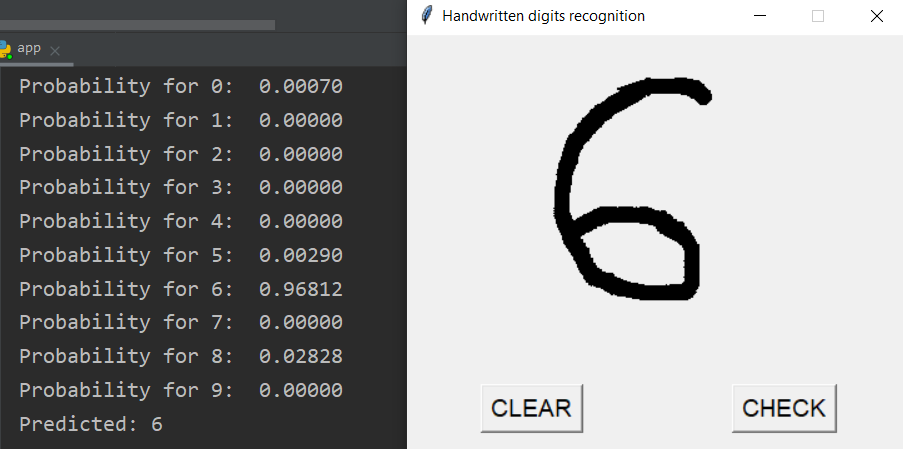
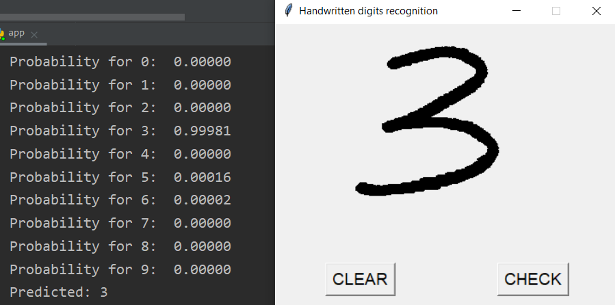

## Handwritten digits recognition using Convolutional Neural Network.
<!-- 
TODO:
Come up with something to say here.
-->
### *ABOUT*
My first Machine Learning project. It uses the Deep Convolutional Neural Network to predict and return the probability distribution for the drawn digit.

